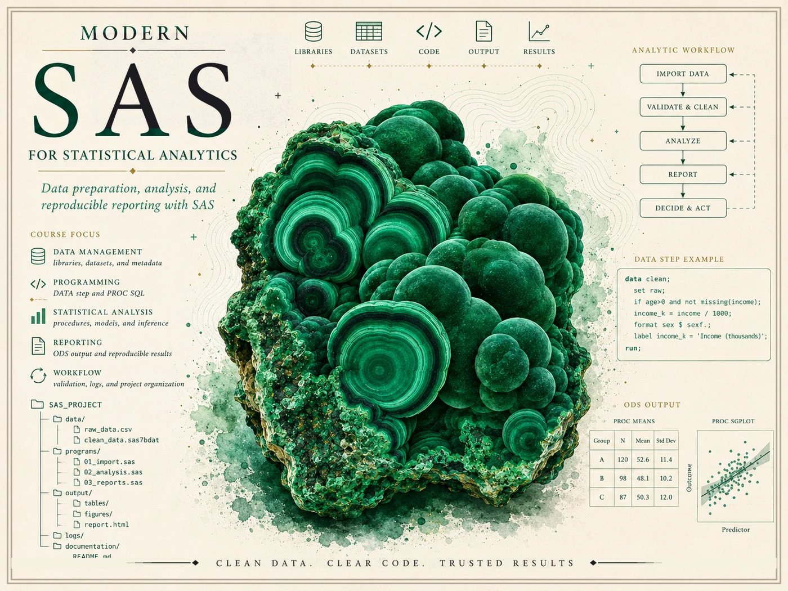

{.course-hero-img fig-alt="Course identity hero for Modern SAS for Statistical Analytics — a banded green malachite crystal surrounded by SAS analytics-workflow graphics including an import-validate-analyze-report-decide pipeline, a DATA step example, a SAS project folder tree, a PROC MEANS table, and a PROC SGPLOT scatterplot, with the course title."}

# Modern SAS for Statistical Analytics {.course-landing-title}

::: {.course-landing-subtitle}
From messy data to documented, reproducible, verified results — the professional SAS workflow
:::

> SAS is not just a language for running procedures. It is a professional analytics **environment** — a place
> to move data from raw and messy to clean, validated, analyzed, and reported, where reliability, traceability,
> and clear reporting matter as much as the answer itself. This course teaches you to work in that environment
> the way an analyst does: read the log, check the row counts, confirm the types, validate before you trust the
> output, and say plainly what an analysis does and does not show.

## What this course is

This is a course in **applied statistical analytics with SAS**, built around one idea: real analytic work is a
**workflow**, not a single command. You begin with data that is messy — duplicated rows, a typo where an age
reads `199`, a date imported as text, blank values, impossible measurements — and you move it, step by
documented step, to a result another person could rerun and verify. Along the way you set up a SAS project and
libraries, write DATA steps, import and clean and validate data, join tables with PROC SQL, summarize with PROC
MEANS and PROC FREQ, produce report-ready output through ODS, run the core statistical procedures, reshape and
merge, simulate, and finally assemble the whole pipeline into one reproducible analysis report.

The throughline on every page is that **workflow**, and its soul is **reliability, traceability, and
verification**. SAS is a deep system, but this course keeps syntax in service of a reliable, traceable analysis
— never the other way around. After every program you read the log (the `NOTE`/`WARNING`/`ERROR` lines that are
SAS's primary output), check the counts, confirm a variable is the type you expect, and ask the recurring
question of the course: **"would someone else be able to understand, rerun, and verify this?"** That habit, more
than any one procedure, is what the course is trying to build.

This is a **professional SAS analytics-workflow** course. It is not a generic programming course, not a generic
intro-statistics course, and not a SAS-syntax reference. The statistics it uses — a t-test, an ANOVA, a
regression, a logistic model — are tools in the workflow, introduced where the analysis needs them and always
interpreted responsibly. No prior SAS experience is assumed; the course builds SAS up gradually from the
environment itself.

## What you will be able to do

By the end of the term, you should be able to:

- Describe SAS as a professional analytics environment and explain what an analytics workflow is — from messy
  data to a documented, reproducible result.
- Open and navigate the SAS environment, organize an analytics project into folders, and assign a `libname`
  library pointing at permanent data.
- Read a SAS **log** as primary output — distinguishing `NOTE`, `WARNING`, and `ERROR`, and checking the
  observation count after every step.
- Work with libraries, datasets, observations, and variables, and control display with **labels**, **formats**,
  and **informats** (reading a character date like `"08/24/2026"` into a real SAS date).
- Write **DATA step** logic — `IF/THEN`, subsetting, derived variables — and handle missing values correctly,
  including the classic `if x < 5` includes-missing trap.
- Import external data, then **clean and validate** it: detect duplicates, type problems, and impossible
  values; document the move from raw rows to a clean analysis dataset.
- Distinguish **character vs numeric** variables and recognize why it is load-bearing — a number stored as
  character blocks PROC MEANS until a `put`/`input` conversion fixes it.
- Join tables with **PROC SQL** (inner vs left join) and with the DATA step **MERGE**, and **check the output
  row count against what you expect** every time.
- Summarize data with **PROC MEANS**, **PROC FREQ**, and **PROC UNIVARIATE**, reading proportions, counts, and
  `N` vs `NMISS` correctly.
- Produce report-ready **ODS** output (HTML, PDF, RTF) and graphics with **PROC SGPLOT/SGPANEL**.
- Run and interpret the core statistical procedures — **PROC TTEST**, **PROC GLM/ANOVA**, **PROC REG**, and
  **PROC LOGISTIC** — stating each procedure's assumptions before its conclusions.
- Keep the interpretation honest: distinguish statistical significance from practical importance, an odds ratio
  from a risk ratio, and an association from a cause in observational data.
- **Reshape and merge** data with PROC TRANSPOSE and MERGE, validating that the row count is what the grain of
  the data implies.
- Use **simulation** — `call streaminit(...)`, `RAND`, and PROC SURVEYSELECT — to study power, error rates, and
  sampling variability, with a fixed seed for reproducibility.
- Assemble a complete analysis as **one reproducible program** with a verification-notes section, and write up
  what the analysis does and does not show.
- Apply the recurring **verification discipline** — what the log should say, the row-count check, the type
  check, the range sanity check — to your own work.

These goals correspond to the 16 outcomes in the syllabus, summarized here for orientation. The authoritative,
graded versions of these goals — with their checkpoints and due dates — live in **Blackboard (the LMS)**.

## How the site is organized

This public site has three working areas, reachable from the sidebar:

- **[Notes](notes/index.qmd)** — the weekly instructional spine, 15 weeks following the workflow from "what SAS
  is for" through importing, cleaning, joining, summarizing, the statistical procedures, simulation, and a
  reproducible report. Each week poses a workflow question, develops the idea, shows the SAS code with its
  synthetic log and output, names a common mistake, and offers ungraded self-checks. Start here.
- **[Labs](labs/index.qmd)** — the hands-on strand. Four short labs (companions to weeks 4, 6, 10, and 13) walk
  you through building and validating a DATA step, joining tables and checking relationships, fitting a
  regression with diagnostics, and running a simulation. The SAS code is shown for study; you run it in your own
  SAS environment.
- **[Resources](resources/index.qmd)** — a SAS workflow glossary, a side-by-side procedure reference, a log-and-
  verification guide, and a SAS academic-access and project-organization page. Keep these open while you read.

## Software

The course uses a **course-designated SAS environment** — SAS Studio via **SAS OnDemand for Academics**, **SAS
Viya for Learners**, **SAS Skill Builder for Students**, or a university-supported SAS installation. The exact
provisioned environment is a **syllabus placeholder for now** (set up when available); the
[SAS academic-access page](resources/sas-access-setup.qmd) explains how to obtain access once it is confirmed.

On this site, **SAS is shown as static, syntax-highlighted code** in plain `sas` code blocks and is
**not executed in place**. SAS is proprietary, and no SAS was run in this build. Every SAS **log** excerpt and
every PROC **output** table you see is a **hand-authored synthetic listing** — drafted "as if run" for teaching
— so the site renders deterministically and SAS-free. You run the real programs yourself in your own SAS
environment, which is exactly how you will work on the labs.

## Source and attribution

These notes are the course's own synthesis, **grounded in but not copied from** three tiers of sources:

- **Primary spine (Tier 1) — instructor-original SAS workflow notes.** The notes, examples, SAS code, and the
  recurring synthetic study on this site are instructor-original. They lead the sequence, the terminology, the
  example ecology, and the rigor. This is the course's own material, written for it.
- **Reference (Tier 3, proprietary) — official SAS documentation.** The SAS documentation
  ([documentation.sas.com](https://documentation.sas.com/), [support.sas.com](https://support.sas.com/)) is
  **copyrighted by SAS Institute Inc., all rights reserved**. The notes **link and cite** specific doc pages as
  reading pointers, in the course's own words, with at most a short attributed quote — they **never** reproduce
  or closely paraphrase SAS-doc prose, examples, listings, tables, or figures, and the course never becomes a
  mirror of the SAS reference. Learning to read the documentation is itself a course skill.
- **Background (Tier 2, OER) — Introduction to Modern Statistics (IMS).** *Introduction to Modern Statistics*,
  2nd ed. (Çetinkaya-Rundel & Hardin) — free at
  [openintro-ims.netlify.app](https://openintro-ims.netlify.app/), **License: CC BY-SA 3.0** — is used **only
  for statistical background** (a review of t-tests, ANOVA, regression, logistic regression, and responsible
  interpretation) on the statistical-procedure weeks, never as a SAS syntax manual. No IMS prose, examples,
  figures, or solutions are reproduced.

All example data on this site are **synthetic, with the seed set** (`call streaminit(20260824)`); the prose and
SAS code are original. **SAS® and all SAS Institute product names are the property of SAS Institute Inc.**

## A note on what is public here

Everything on this site is **public and ungraded** — study material only. You will not find graded prompts,
answer keys, rubrics, point values, or due dates here. The operational side of the course — graded SAS workflow
checkpoints, skill checks, homework, analytics labs, the midterm practical, the final analytics project, and the
final practical, along with all dates and submissions — lives in **Blackboard (the LMS)**, which is
authoritative. If this site and Blackboard ever disagree, follow Blackboard.

::: {.callout-note}
## Draft course site

This site is a **draft course site**, not a finished release. **No SAS was run**: every SAS
program, log excerpt, and PROC output table is **hand-authored and synthetic** (the wellness-program study, seed
`streaminit(20260824)`), drafted "as if run" and **provisional pending human/SAS-run review**. The statistical
results are invented for teaching, the study is **synthetic and observational** (not real health data, and not
causal), and **no accessibility-compliance claim** is made. Treat it as a work in progress rather than the final
word.
:::
